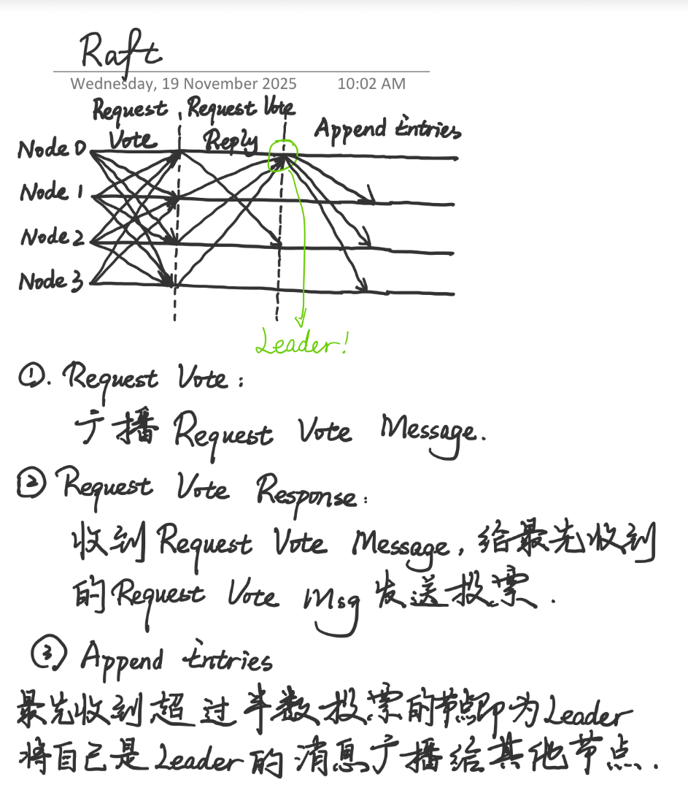

## How to run the code

If your operation system is MacOS, you can use the command './run_nodes.sh' to run the code.

If you use other operation system, you can use AI to generate a shell to run the code.

## Code Logic

The code is to implement Raft, a communication-based leader election mechanism.

The logic is shown in the following figure.

